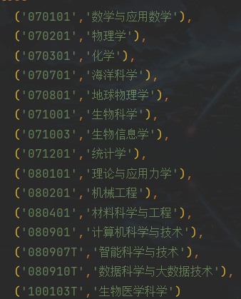

# OOAD project: Dormitory

## Setup

### Installing

拉取仓库

### Configuration

本地必须先配置postgre数据库，数据库名为dormitoryDB，所属用户和密码需在application.properties编辑。

默认网页端口为8443

### Run

程序入口为BackendApplication.java，位于./src/main/java/com.dormitory.backend/下

## Api doc

本项目使用springdoc 2.1，运行BackendApplication.java后，访问http://localhost:8443/swagger-ui/index.html#/ 查看自动生成的api文档。

### Others

**Login/Register:**

Register -> Profile -> Home

Login -> Home

**Dormitory:**

Home -> Click search dormitory module

-> find specific area till dormitory -> do operation on dormitory

## Bugs

### Query may raise a null pointer exception

#### Desciption:

If an object has a null **integer** attribute,
when a query trying to select such object, JPA will raise a null pointer exception.

#### Reason:

JPA may apply Integer.parseInt() on returned attribute,
but such method does not allow a null input.

#### Solution:

Input check: do not set a null value on int attribute.

### object references an unsaved transient instance - save the transient instance before flushing

#### Description:

If trying to directly save an object (entity) from front-end into a table when the object has
a **reference attribute (foreign key)**, the error may be raised.

#### Reason:

The **reference attribute** is not the same as the one in database - 
at least the id is likely different or lost. Thus, system will assume that
is a "new" attribute, and when saving an object with a "new" reference attribute
not in database, the error will be triggered.

#### Solution:

Always retrieve the reference attribute (entity) from database by the information
given by front-end, then re-assemble the object before saving it.

## Notice

### Subject information

At src/main/resources/subject.sql,

