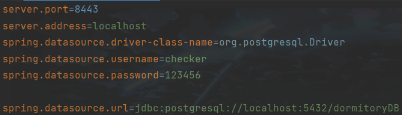

# OOAD project: Dormitory

## Setup

### Installing

拉取仓库

### Configuration

本地必须先配置postgre数据库，数据库名为dormitoryDB，所属用户和密码需在application.properties编辑。

默认网页端口为8443

### Run

程序入口为BackendApplication.java，位于./src/main/java/com.dormitory.backend/下

## Api doc

本项目使用springdoc 2.1，运行BackendApplication.java后，访问http://localhost:8443/swagger-ui/index.html#/ 查看自动生成的api文档。

### Others

**Login/Register:**

Register -> Profile -> Home

Login -> Home

**Dormitory:**

Home -> Click search dormitory module

-> find specific area till dormitory -> do operation on dormitory

